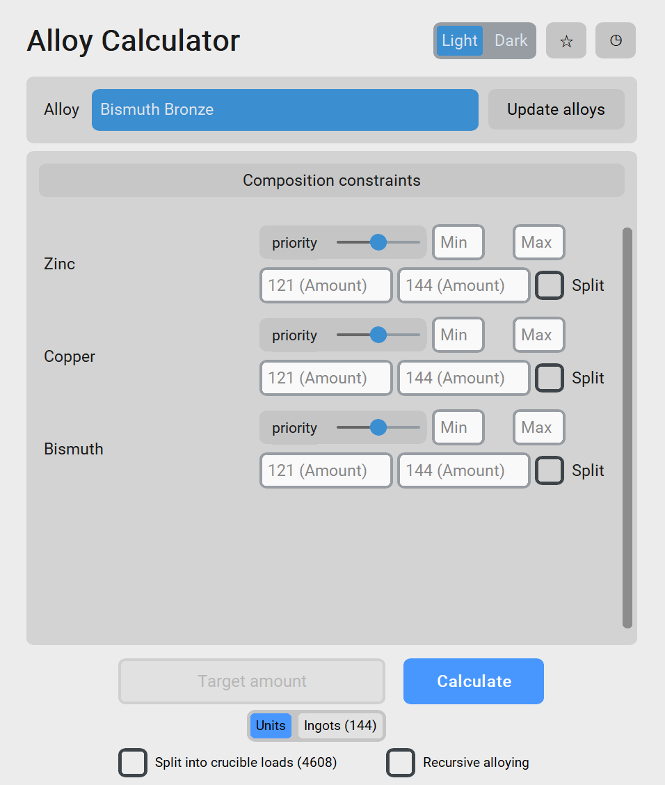
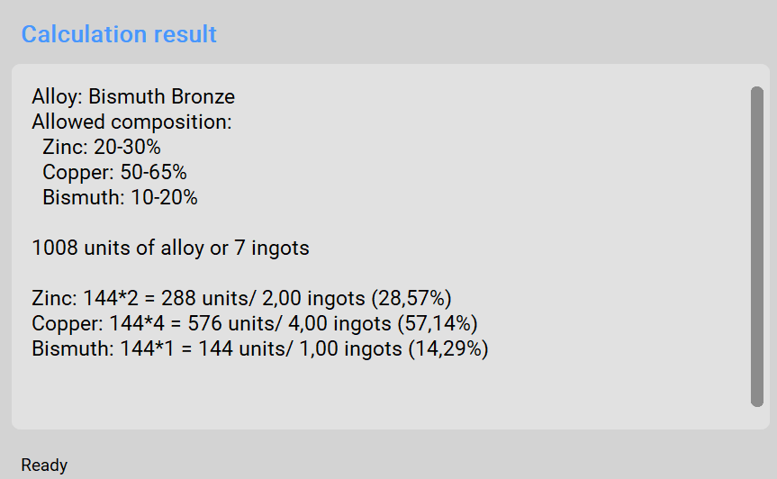

# Alloy Composition Calculator 
<p align="center">
  
</p>

## A lightweight calculator for planning TerraFirmaGreg-modern and TerraFirmaCraft(WIP) alloy recipes.

TerraFirmaCraft uses an alloying system that allows a certain percentage tolerance for each metal in a recipe. There are simple utilities that can calculate the percentage ratios from the amounts of metal entered by the user. This project takes a more advanced approach, providing a calculator that significantly simplifies the process.

Choose a recipe, enter your constraints, and get the required component amounts for a target batch, including recursively calculating the composition of alloys used as components in other alloys. It can also account for different-sized batches crucible capacity.

In this project, a **batch** is any item containing a meltable metal. For example, 3 pieces of `Chalcopyrite Dust` are considered 3 `copper` **batches** of 121 units each.

## Features

- Calculate a valid alloy composition from component constraints.
- Priority system. Set priorities to control how much of each metal is consumed.
- Create/remove alloy recipes or import them automatically from a Minecraft instance with the included parser.
- Work in units or ingots of 144 units.
- Split a target amount into feasible crucible loads of 4,608 units.
- Recursive alloying. If an alloy component is itself an alloy, its composition can be calculated automatically.
- Save recipes and revisit recent calculations.


## Requirements

- **Python 3.10** or newer
- `numpy`
- `scipy`
- `customtkinter`

## Installation

Set up a virtual environment and install the dependencies:

```bash
python -m pip install -r requirements.txt
```

## Run the Calculator

Start the application with:

```bash
python launch.py
```

The application reads recipe data from `alloys.json` and the color palette from `colors.json`. User favorites and calculation history are stored in `user_data.json`.

> Note: on first launch, the app may ask for the full path to your minecraft instance folder.

## Importing Alloy Recipes Automatcally

The project includes a parser for importing alloy recepies from a Minecraft instance.

This parcer is made specifically for the TFG-Modern modpack, but it ***may*** also work with other modpacks (not guaranteed, WIP).

`parcer.py` scans alloy recipes from mods, KubeJS scripts and datapacks.

Parser also attempts to resolve readable English names for metals and alloys.

Running it from CLI requires the path to the instance root:

```bash
python parcer.py "C:\path\to\minecraft\instance"
```
e.g.
```bash
python parcer.py "C:\Users\MyUsername\AppData\Roaming\.minecraft\versions\1.20.1 TFG"
```

The result is saved to `alloys.json` in the project directory.

> If no path is supplied, the current directory is used.

> If `alloys.json` gets damaged/deleted, run the command above, parcer creates this file automatically if needed.


It could also be called from GUI directly with an `Update alloys` button.


---
## User Guide
<p align="center">
  
   </br>
   <em>
      Application interface
   </em>
</p>

1. **Select an alloy.**
2. **Enter your data**. All boxes are optional. The result depends on whether `Target amount` is specified or not.

    **2.1. Target amount specified.**

    Calculate how much of each metal is needed to produce an alloy while taking various constraints into account. 
    
    The alloy composition will be displayed, with different parameters available for each metal individually.
    
    **Priority** — a slider from lowest to highest priority, with the middle as the default. During the calculation, the program will try to follow the priority system by using as much as possible of the metals with higher priorities and as little as possible of the metals with lower priorities.
    
    **min / max** — absolute limits for the alloy calculation. The program will never go below or above these values.

    **121 (amount) / 144 (amount)** — the number of 121-unit and 144-unit batches available to the player, respectively. In other words, this is the amount of metal-containing items currently available. This works similarly to the `max` field, but is more convenient for counting, as there is no need to convert batches into the total amount of liquid metal.

    > Basic TFC units (10, 25, 50, 75, 100) are WIP.

    > If no upper-limit constraints (`max`, `121`, `144`) are specified for a metal, the calculation assumes an unlimited number of 144-unit batches for it and uses the priority system to determine its contribution in the composition.

    **Split** — allows metal dust to be split into small and tiny piles, making it possible to achieve a more precise result. In many cases, this makes it possible to find a solution where the resulting amount of alloy is exactly equal to the requested amount. This is especially useful when you want to produce an exact number of ingots with no excess.

    At the bottom, there is a **Target Amount** field itself, where you specify how much alloy you want to produce (in ingots or units), along with  checkboxes:
    
    >**Split into crucible loads.** Allows the program to automatically divide the total amount of metal into suitable crucible batches if it cannot all fit into the crucible at once.
    >
    >**Recursive alloying.** If an alloy has another alloys for its components, a popup will appear for each one to specify parameters for calculating their respective compositions.

    **2.2. Target Amount is not specified**

    The reverse of the previous problem. Enter how much of each component is available, and the program calculates the maximum possible amount of the desired alloy that can be produced from those components.
3. **Result.**
   
The program displays the selected alloy recipe, followed by the calculated alloy amount and its resulting composition. If crucible splitting is enabled, the output also includes the required amount for each crucible load.

<p align="center">
  
   </br>
   <em>
      Example
   </em>
</p>

